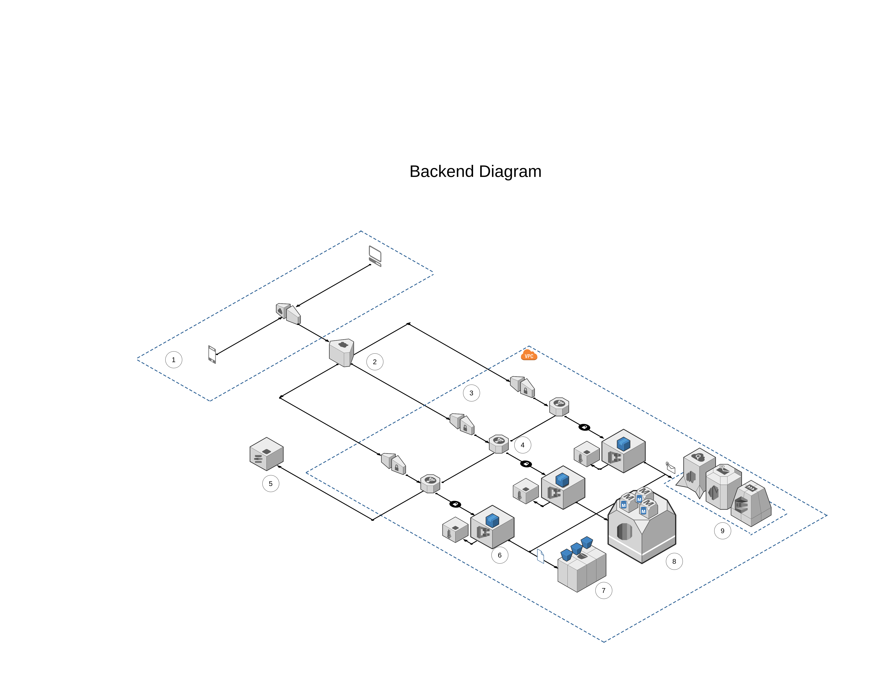
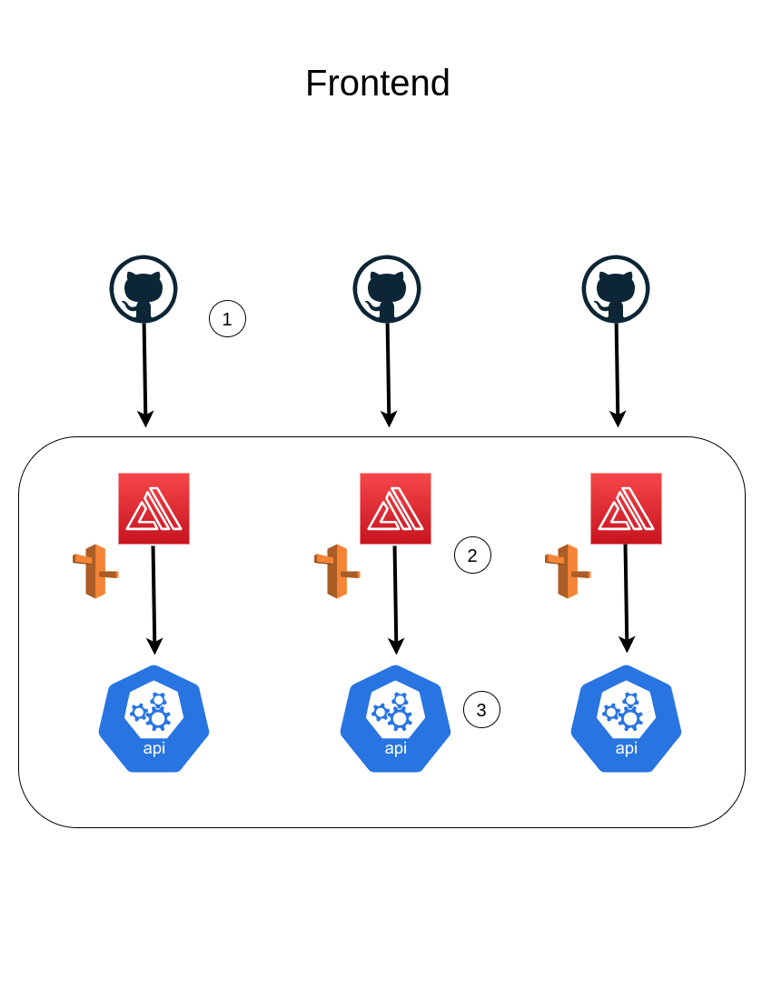

# The Glew infrastructure generator

## Requirements

- [Terraform](https://learn.hashicorp.com/tutorials/terraform/install-cli)
- [AWS CLI](https://docs.aws.amazon.com/cli/latest/userguide/cli-chap-install.html)

## Build Infrastructure

Run the following commands:

```shell
# To start terraform configuration in your local repo

~$ terraform init

# Then, check that everything is ok

~$ terraform plan

# Finally, apply all configs inside terraform/ folder

~$ terraform apply

```

## AWS infrastructure

Below you can see how infrastructure is defined in AWS.

### Backend



1.- Mobile and web clients make a request to AWS.

2.- **AWS Route 53** redirects this request to its corresponding Application Load Balancer (ALB) based on its URL:

- **api.theglew.io**: Redirects to lb-production-1162650088.us-east-1.elb.amazonaws.com
- **api-dev.theglew.io**: Redirects to lb-develop-2053135013.us-east-1.elb.amazonaws.com
- **api-staging.theglew.io**: Redirects to lb-staging-670318428.us-east-1.elb.amazonaws.com

3.- All **ALB** points to a target group. This target group is, at the same time, connected to an ECS cluster. All ALB requests done to these ALB are redirected by its listeners to HTTPS.

4.- **SSL certification** is managed by **ACM**. The SSL certificate ARN is connected to each ALB Listener.

5.- Every target group contains an **ECS cluster**. All clusters are connected to a **CloudWatch** log group. Each cluster runs a version of the backend app docker image.

6.- All ECS clusters are connected to its respective **AWS S3** bucket for files and media storage.

7.- All ECS clusters are connected to a single instance in AWS RDS. This instance contains three databases, one assigned to each environment.

8.- All ECS clusters are connected to AWS Simple Email Service (**SES**). This service is connected to AWS Simple Notification Service (**SNS**) to enable push notifications for mobile client, and AWS Simple Queue Service (**SQS**) to manage email sending and notifications asynchronously.

### Frontend



1.- When a push event is triggered from `develop` `staging` or `main` branches, a CD process starts automatically.

2.- **AWS Amplify** build a new version of the application that is connected to this branch. **AWS Route 53** is connected to every CDN given by AWS Amplify:

- `main` branch connects to [production](app.theglew.io) domain and its [CloudFront](d1b0gl71ihdu7h.cloudfront.net) URL.
- `develop` branch connects to [development](dev.theglew.io) domain and its [CloudFront](d1b0gl71ihdu7h.cloudfront.net) URL.
- `staging` branch connects to [staging](staging.theglew.io) domain and its [CloudFront](d1b0gl71ihdu7h.cloudfront.net).

3.- All **AWS Amplify** running apps are connected to their respective API URLs:

- `app.theglew.io` is connected to `api.theglew.io`.
- `dev.theglew.io` is connected to `api-dev.theglew.io`.
- `staging.theglew.io` is connected to `api-staging.theglew.io`.
